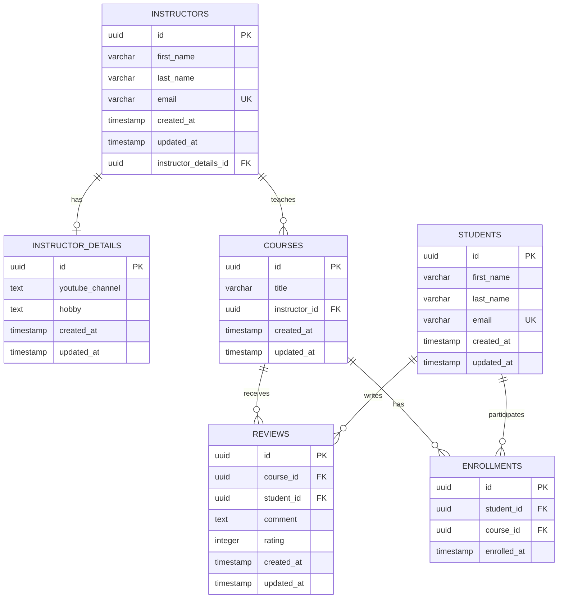

# 🗄️ Database Schema Reference

Complete database schema documentation for the Course Management System.

## Overview

The database schema is designed to support a comprehensive course management system with instructors, students, courses, reviews, and enrollments. The schema uses PostgreSQL with UUID primary keys for better scalability and security.

## 📊 Entity Relationship Diagram



## 📋 Table Definitions

### instructors

Core instructor information table.

```sql
CREATE TABLE instructors (
    id UUID PRIMARY KEY DEFAULT gen_random_uuid(),
    first_name VARCHAR(50) NOT NULL,
    last_name VARCHAR(50) NOT NULL,
    email VARCHAR(100) NOT NULL UNIQUE,
    instructor_details_id UUID,
    created_at TIMESTAMP NOT NULL DEFAULT CURRENT_TIMESTAMP,
    updated_at TIMESTAMP NOT NULL DEFAULT CURRENT_TIMESTAMP,
    
    CONSTRAINT fk_instructor_details 
        FOREIGN KEY (instructor_details_id) 
        REFERENCES instructor_details(id) 
        ON DELETE SET NULL
);

-- Indexes
CREATE INDEX idx_instructors_email ON instructors(email);
CREATE INDEX idx_instructors_name ON instructors(first_name, last_name);
CREATE INDEX idx_instructors_created_at ON instructors(created_at);
```

**Columns:**
- `id`: Primary key, UUID for global uniqueness
- `first_name`: Instructor's first name (required, max 50 chars)
- `last_name`: Instructor's last name (required, max 50 chars)
- `email`: Unique email address (required, max 100 chars)
- `instructor_details_id`: Foreign key to instructor_details (optional)
- `created_at`: Record creation timestamp
- `updated_at`: Last modification timestamp

**Constraints:**
- `email` must be unique across all instructors
- `instructor_details_id` can be null (optional one-to-one relationship)

### instructor_details

Extended instructor profile information.

```sql
CREATE TABLE instructor_details (
    id UUID PRIMARY KEY DEFAULT gen_random_uuid(),
    youtube_channel TEXT,
    hobby TEXT,
    created_at TIMESTAMP NOT NULL DEFAULT CURRENT_TIMESTAMP,
    updated_at TIMESTAMP NOT NULL DEFAULT CURRENT_TIMESTAMP
);

-- Indexes
CREATE INDEX idx_instructor_details_youtube ON instructor_details(youtube_channel);
CREATE INDEX idx_instructor_details_hobby ON instructor_details(hobby);
```

**Columns:**
- `id`: Primary key, UUID
- `youtube_channel`: Instructor's YouTube channel URL (optional)
- `hobby`: Instructor's hobbies or interests (optional)
- `created_at`: Record creation timestamp
- `updated_at`: Last modification timestamp

**Usage Notes:**
- Can exist independently (orphaned details)
- Linked to instructors via one-to-one relationship

### courses

Course catalog information.

```sql
CREATE TABLE courses (
    id UUID PRIMARY KEY DEFAULT gen_random_uuid(),
    title VARCHAR(200) NOT NULL,
    instructor_id UUID NOT NULL,
    created_at TIMESTAMP NOT NULL DEFAULT CURRENT_TIMESTAMP,
    updated_at TIMESTAMP NOT NULL DEFAULT CURRENT_TIMESTAMP,
    
    CONSTRAINT fk_course_instructor 
        FOREIGN KEY (instructor_id) 
        REFERENCES instructors(id) 
        ON DELETE CASCADE
);

-- Indexes
CREATE INDEX idx_courses_instructor_id ON courses(instructor_id);
CREATE INDEX idx_courses_title ON courses(title);
CREATE INDEX idx_courses_created_at ON courses(created_at);
CREATE UNIQUE INDEX idx_courses_title_instructor ON courses(title, instructor_id);
```

**Columns:**
- `id`: Primary key, UUID
- `title`: Course title (required, max 200 chars)
- `instructor_id`: Foreign key to instructors (required)
- `created_at`: Record creation timestamp
- `updated_at`: Last modification timestamp

**Constraints:**
- `instructor_id` must reference an existing instructor
- Unique constraint on `(title, instructor_id)` - same instructor can't have duplicate course titles
- Cascade delete when instructor is deleted

### students

Student information table.

```sql
CREATE TABLE students (
    id UUID PRIMARY KEY DEFAULT gen_random_uuid(),
    first_name VARCHAR(50) NOT NULL,
    last_name VARCHAR(50) NOT NULL,
    email VARCHAR(100) NOT NULL UNIQUE,
    created_at TIMESTAMP NOT NULL DEFAULT CURRENT_TIMESTAMP,
    updated_at TIMESTAMP NOT NULL DEFAULT CURRENT_TIMESTAMP
);

-- Indexes
CREATE INDEX idx_students_email ON students(email);
CREATE INDEX idx_students_name ON students(first_name, last_name);
CREATE INDEX idx_students_created_at ON students(created_at);
```

**Columns:**
- `id`: Primary key, UUID
- `first_name`: Student's first name (required, max 50 chars)
- `last_name`: Student's last name (required, max 50 chars)
- `email`: Unique email address (required, max 100 chars)
- `created_at`: Record creation timestamp
- `updated_at`: Last modification timestamp

**Constraints:**
- `email` must be unique across all students

### reviews

Course reviews and ratings by students.

```sql
CREATE TABLE reviews (
    id UUID PRIMARY KEY DEFAULT gen_random_uuid(),
    course_id UUID NOT NULL,
    student_id UUID NOT NULL,
    comment TEXT NOT NULL,
    rating INTEGER NOT NULL CHECK (rating >= 1 AND rating <= 5),
    created_at TIMESTAMP NOT NULL DEFAULT CURRENT_TIMESTAMP,
    updated_at TIMESTAMP NOT NULL DEFAULT CURRENT_TIMESTAMP,
    
    CONSTRAINT fk_review_course 
        FOREIGN KEY (course_id) 
        REFERENCES courses(id) 
        ON DELETE CASCADE,
    
    CONSTRAINT fk_review_student 
        FOREIGN KEY (student_id) 
        REFERENCES students(id) 
        ON DELETE CASCADE,
    
    CONSTRAINT uk_review_student_course 
        UNIQUE (student_id, course_id)
);

-- Indexes
CREATE INDEX idx_reviews_course_id ON reviews(course_id);
CREATE INDEX idx_reviews_student_id ON reviews(student_id);
CREATE INDEX idx_reviews_rating ON reviews(rating);
CREATE INDEX idx_reviews_created_at ON reviews(created_at);
```

**Columns:**
- `id`: Primary key, UUID
- `course_id`: Foreign key to courses (required)
- `student_id`: Foreign key to students (required)
- `comment`: Review text content (required)
- `rating`: Numeric rating from 1-5 (required)
- `created_at`: Record creation timestamp
- `updated_at`: Last modification timestamp

**Constraints:**
- `rating` must be between 1 and 5 (inclusive)
- Unique constraint on `(student_id, course_id)` - one review per student per course
- Cascade delete when course or student is deleted

### enrollments

Student course enrollment tracking.

```sql
CREATE TABLE enrollments (
    id UUID PRIMARY KEY DEFAULT gen_random_uuid(),
    student_id UUID NOT NULL,
    course_id UUID NOT NULL,
    enrolled_at TIMESTAMP NOT NULL DEFAULT CURRENT_TIMESTAMP,
    
    CONSTRAINT fk_enrollment_student 
        FOREIGN KEY (student_id) 
        REFERENCES students(id) 
        ON DELETE CASCADE,
    
    CONSTRAINT fk_enrollment_course 
        FOREIGN KEY (course_id) 
        REFERENCES courses(id) 
        ON DELETE CASCADE,
    
    CONSTRAINT uk_enrollment_student_course 
        UNIQUE (student_id, course_id)
);

-- Indexes
CREATE INDEX idx_enrollments_student_id ON enrollments(student_id);
CREATE INDEX idx_enrollments_course_id ON enrollments(course_id);
CREATE INDEX idx_enrollments_enrolled_at ON enrollments(enrolled_at);
```

**Columns:**
- `id`: Primary key, UUID
- `student_id`: Foreign key to students (required)
- `course_id`: Foreign key to courses (required)
- `enrolled_at`: Enrollment timestamp (auto-generated)

**Constraints:**
- Unique constraint on `(student_id, course_id)` - prevents duplicate enrollments
- Cascade delete when student or course is deleted

## 🔗 Relationships

### One-to-One: Instructor ↔ InstructorDetails

```sql
-- Optional relationship (instructor can exist without details)
ALTER TABLE instructors 
ADD CONSTRAINT fk_instructor_details 
FOREIGN KEY (instructor_details_id) 
REFERENCES instructor_details(id) 
ON DELETE SET NULL;
```

**Characteristics:**
- Optional relationship (instructor_details_id can be null)
- Instructor details can exist independently (orphaned)
- Cascading delete sets instructor_details_id to null

### One-to-Many: Instructor → Courses

```sql
-- Required relationship (course must have an instructor)
ALTER TABLE courses 
ADD CONSTRAINT fk_course_instructor 
FOREIGN KEY (instructor_id) 
REFERENCES instructors(id) 
ON DELETE CASCADE;
```

**Characteristics:**
- Required relationship (instructor_id cannot be null)
- One instructor can teach multiple courses
- Cascading delete removes all courses when instructor is deleted

### Many-to-Many: Student ↔ Course (via Enrollments)

```sql
-- Join table with additional metadata
CREATE TABLE enrollments (
    -- Primary key and foreign keys
    -- enrolled_at timestamp for additional information
);
```

**Characteristics:**
- Implemented using join table pattern
- Additional metadata (enrollment timestamp)
- Unique constraint prevents duplicate enrollments

### Many-to-One: Course ← Reviews

```sql
-- Multiple reviews per course
ALTER TABLE reviews 
ADD CONSTRAINT fk_review_course 
FOREIGN KEY (course_id) 
REFERENCES courses(id) 
ON DELETE CASCADE;
```

**Characteristics:**
- One course can have multiple reviews
- Reviews are deleted when course is deleted
- Unique constraint prevents multiple reviews from same student

## 📊 Database Statistics Views

### Course Statistics View

```sql
CREATE VIEW course_statistics AS
SELECT 
    c.id,
    c.title,
    c.instructor_id,
    i.first_name || ' ' || i.last_name AS instructor_name,
    COUNT(DISTINCT e.student_id) AS enrollment_count,
    COUNT(DISTINCT r.id) AS review_count,
    ROUND(AVG(r.rating)::numeric, 2) AS average_rating,
    c.created_at,
    c.updated_at
FROM courses c
LEFT JOIN instructors i ON c.instructor_id = i.id
LEFT JOIN enrollments e ON c.id = e.course_id
LEFT JOIN reviews r ON c.id = r.course_id
GROUP BY c.id, c.title, c.instructor_id, i.first_name, i.last_name, c.created_at, c.updated_at;
```

### Student Statistics View

```sql
CREATE VIEW student_statistics AS
SELECT 
    s.id,
    s.first_name,
    s.last_name,
    s.email,
    COUNT(DISTINCT e.course_id) AS enrolled_courses,
    COUNT(DISTINCT r.id) AS reviews_written,
    ROUND(AVG(r.rating)::numeric, 2) AS average_rating_given,
    s.created_at,
    s.updated_at
FROM students s
LEFT JOIN enrollments e ON s.id = e.student_id
LEFT JOIN reviews r ON s.id = r.student_id
GROUP BY s.id, s.first_name, s.last_name, s.email, s.created_at, s.updated_at;
```

### Instructor Statistics View

```sql
CREATE VIEW instructor_statistics AS
SELECT 
    i.id,
    i.first_name,
    i.last_name,
    i.email,
    COUNT(DISTINCT c.id) AS courses_taught,
    COUNT(DISTINCT e.student_id) AS total_students,
    COUNT(DISTINCT r.id) AS total_reviews,
    ROUND(AVG(r.rating)::numeric, 2) AS average_course_rating,
    i.created_at,
    i.updated_at
FROM instructors i
LEFT JOIN courses c ON i.id = c.instructor_id
LEFT JOIN enrollments e ON c.id = e.course_id
LEFT JOIN reviews r ON c.id = r.course_id
GROUP BY i.id, i.first_name, i.last_name, i.email, i.created_at, i.updated_at;
```

## 🔍 Common Queries

### Find Popular Courses

```sql
SELECT 
    c.title,
    i.first_name || ' ' || i.last_name AS instructor_name,
    COUNT(e.student_id) AS enrollment_count,
    ROUND(AVG(r.rating)::numeric, 2) AS average_rating
FROM courses c
JOIN instructors i ON c.instructor_id = i.id
LEFT JOIN enrollments e ON c.id = e.course_id
LEFT JOIN reviews r ON c.id = r.course_id
GROUP BY c.id, c.title, i.first_name, i.last_name
HAVING COUNT(e.student_id) > 0
ORDER BY enrollment_count DESC, average_rating DESC NULLS LAST;
```

### Find Students with Most Enrollments

```sql
SELECT 
    s.first_name || ' ' || s.last_name AS student_name,
    s.email,
    COUNT(e.course_id) AS enrolled_courses,
    COUNT(r.id) AS reviews_written
FROM students s
LEFT JOIN enrollments e ON s.id = e.student_id
LEFT JOIN reviews r ON s.id = r.student_id
GROUP BY s.id, s.first_name, s.last_name, s.email
ORDER BY enrolled_courses DESC, reviews_written DESC;
```

### Find Courses Needing Reviews

```sql
SELECT 
    c.title,
    i.first_name || ' ' || i.last_name AS instructor_name,
    COUNT(e.student_id) AS enrolled_students,
    COUNT(r.id) AS review_count,
    COUNT(e.student_id) - COUNT(r.id) AS missing_reviews
FROM courses c
JOIN instructors i ON c.instructor_id = i.id
LEFT JOIN enrollments e ON c.id = e.course_id
LEFT JOIN reviews r ON c.id = r.course_id
GROUP BY c.id, c.title, i.first_name, i.last_name
HAVING COUNT(e.student_id) > COUNT(r.id)
ORDER BY missing_reviews DESC;
```

## 🛠️ Database Maintenance

### Backup and Restore

```sql
-- Create backup
pg_dump -h localhost -U admin -d course_management_db > backup.sql

-- Restore from backup
psql -h localhost -U admin -d course_management_db < backup.sql
```

### Index Maintenance

```sql
-- Check index usage
SELECT 
    schemaname,
    tablename,
    indexname,
    idx_scan as index_scans,
    idx_tup_read as tuples_read,
    idx_tup_fetch as tuples_fetched
FROM pg_stat_user_indexes
ORDER BY idx_scan DESC;

-- Rebuild indexes (if needed)
REINDEX TABLE instructors;
REINDEX TABLE courses;
```

### Performance Monitoring

```sql
-- Check table sizes
SELECT 
    schemaname,
    tablename,
    pg_size_pretty(pg_total_relation_size(schemaname||'.'||tablename)) as size
FROM pg_tables 
WHERE schemaname = 'public'
ORDER BY pg_total_relation_size(schemaname||'.'||tablename) DESC;

-- Check slow queries
SELECT 
    query,
    calls,
    total_time,
    mean_time,
    rows
FROM pg_stat_statements
WHERE query LIKE '%courses%' OR query LIKE '%instructors%'
ORDER BY mean_time DESC;
```

## 🔧 Migration Scripts

### Initial Schema Creation

```sql
-- Create tables in correct order (respecting foreign key dependencies)
CREATE TABLE instructor_details (...);
CREATE TABLE instructors (...);
CREATE TABLE students (...);
CREATE TABLE courses (...);
CREATE TABLE reviews (...);
CREATE TABLE enrollments (...);

-- Create indexes
-- Create views
-- Insert initial data (if needed)
```

### Example Migration: Add Course Categories

```sql
-- V2__add_course_categories.sql
CREATE TABLE course_categories (
    id UUID PRIMARY KEY DEFAULT gen_random_uuid(),
    name VARCHAR(100) NOT NULL UNIQUE,
    description TEXT,
    created_at TIMESTAMP NOT NULL DEFAULT CURRENT_TIMESTAMP
);

ALTER TABLE courses ADD COLUMN category_id UUID;

ALTER TABLE courses 
ADD CONSTRAINT fk_course_category 
FOREIGN KEY (category_id) 
REFERENCES course_categories(id) 
ON DELETE SET NULL;

-- Insert default categories
INSERT INTO course_categories (name, description) VALUES
('Programming', 'Software development and programming courses'),
('Design', 'UI/UX and graphic design courses'),
('Business', 'Business and entrepreneurship courses');
```

## 📚 Related Documentation

- **[Getting Started Guide](../guides/getting-started.md)** - Database setup instructions
- **[Architecture Guide](../guides/architecture.md)** - System design and entity relationships
- **[Configuration Reference](./configuration.md)** - Database configuration options
- **[API Documentation](../api/)** - How entities map to API responses

---

*This schema provides a solid foundation for a scalable course management system with proper relationships, constraints, and indexing strategies.* 🗄️